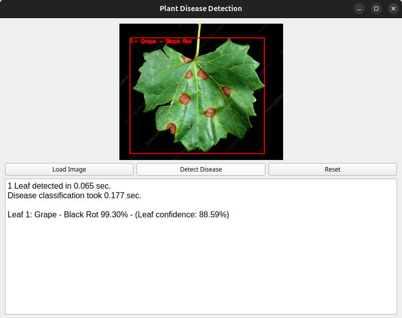

# 🌱 Plant Health Check — Leaf Detection & Disease Classification

This project is a **plant disease detection system** with a **GUI** built using **PyQt5**.\
It uses **YOLOv11** for **leaf detection** and a **TensorFlow/Keras-based classifier** for detecting leaf diseases.

---

## 📌 Features

- **Leaf Detection**: Detects leaves in an image using YOLOv11n or YOLOv11x.
- **Disease Classification**: Classifies each detected leaf as *healthy* or *diseased* using:
    - A **custom CNN** model, or
    - An **EfficientNetB3**-based model.
- **GUI Application**:
    - Load images from file.
    - Run detection and classification with one click.
    - Display results with bounding boxes and confidence scores.
- **Dataset Downloader**: Download and prepare training datasets automatically.
- **Model Training Notebooks**:
    - YOLO11n & YOLO11x training for leaf detection.
    - Custom CNN & EfficientNetB3 training for disease classification.

---

## 🛠 Project Structure

```
plant-health-check/
│
├── main.py                      # PyQt5 GUI application
├── leaf_detector.py             # YOLOv11 leaf detection
├── disease_classifier.py        # TensorFlow/Keras disease classification
├── dataset_downloader.py        # Dataset download & preparation script
│                
├── disease_classifier_customCNN.ipynb       # Jupyter notebook for custom CNN classifier training
├── disease_classifier_EfficientNetB3.ipynb  # Jupyter notebook for EfficientNetB3 classifier training
├── leaf_detector_YOLO11n.ipynb              # Jupyter notebook for YOLOv11n leaf detection training
├── leaf_detector_YOLO11x.ipynb              # Jupyter notebook for YOLOv11x leaf detection training
│
├── requirements.txt             # Python dependencies
│
├── model-checkpoints/           # Saved trained models for disease classification
├── yolo-runs/                   # Saved outputs from YOLO training
│
└── README.md                    # Project documentation
```

---

## 🚀 Installation

### 1. Clone the repository

```bash
git lfs install
git clone https://github.com/httpAlireza/plant-health-check.git
cd plant-health-check
git lfs pull
```

### 2. Create a virtual environment

```bash
python3 -m venv venv
source venv/bin/activate  # On Linux/macOS
venv\Scripts\activate     # On Windows
```

### 3. Install dependencies

```bash
pip install -r requirements.txt
```

---

## 📂 Dataset

You can use the included `dataset_downloader.py` to download the required datasets for:

- **Leaf detection** (YOLOv11 training)
- **Disease classification** (Custom CNN / EfficientNetB3)

(Since Datasets are being downloaded using Kaggle, ensure Kaggle API credentials are set.
Place kaggle.json in ~/.kaggle/ or set environment variables.
The kaggle.json file (API token) can be downloaded from: https://www.kaggle.com/account)

Run:

```bash
python3 dataset_downloader.py
```

---

## 🖥 Running the Application

After installing dependencies and downloading models:

```bash
python3 main.py
```

- Click **Load Image** to select a plant image.
- Click **Detect Disease** to run YOLO detection + classification.
- The results will be shown in the image preview and in the text box.

---

## 🧠 Training Models

Training scripts are provided as Jupyter notebooks:

- **leaf_detector_YOLO11n / leaf_detector_YOLO11x**: For leaf detection.
- **diease_classifier_CustomCNN / diease_classifier_EfficientNetB3**: For disease classification.

You can run them in **Google Colab** or locally.

---

## 📊 Example Results



---

## ✨ Acknowledgements

- [Ultralytics YOLO](https://github.com/ultralytics/ultralytics)
- [TensorFlow](https://www.tensorflow.org/)
- [PyQt5](https://riverbankcomputing.com/software/pyqt/intro)

